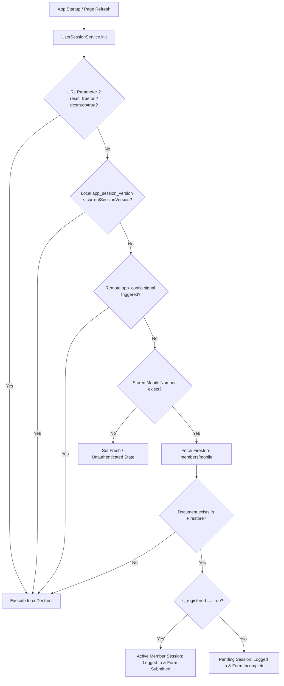

# Session Management & Force Destruct Architecture

## 1. Overview & Problem Context

In modern client-side and web applications, state flags (such as `login`, `mobileNumber`, `is_form_submitted`) are cached in persistent client storage (`FlutterSecureStorage`, `localStorage`). 

Previously, when a user entry was deleted directly from Firestore:
1. `UserSessionService.init()` checked cached keys in local storage.
2. Even though Firestore confirmed that the document no longer existed (`!doc.exists`), the service did not invalidate local flags.
3. UI widgets ([ProfileScreen](file:///Users/jaydip/Jaydip/Projects/maratha_shivmudra/lib/src/screens/profile/profile_screen.dart), [ProfileModalDialog](file:///Users/jaydip/Jaydip/Projects/maratha_shivmudra/lib/src/screens/profile/profile_dialog.dart), and [SideDrawer](file:///Users/jaydip/Jaydip/Projects/maratha_shivmudra/lib/src/screens/landing/widgets/side_drawer.dart)) had fallback logic that instantiated dummy/empty `MemberProfile` shells (`p ?? MemberProfile(...)`), giving the user the impression that their session was still alive and displaying empty profiles.
4. Furthermore, there was no mechanism to trigger a clean slate / fresh restart across clients when deploying breaking schema changes or major updates.

To resolve this permanently, a **Multi-Tier Force Destruct & Session Synchronization System** was implemented.

---

## 2. Multi-Tier Invalidation Architecture



### The Invalidation Tiers

### Tier 1: Real-time DB Existence Sync (Auto-Destruct on Direct Deletion)
- When a phone number is stored locally, `UserSessionService.init()` checks Firestore `members/{mobile}` on every application launch and browser page refresh.
- If `!doc.exists`, it immediately logs a warning and calls `forceDestruct(reason: 'Member record does not exist in database (deleted or removed)')`.
- The user is transitioned to an unauthenticated state and starts completely fresh with registration options.

### Tier 2: Code-Level Session Version Bump (Major Updates)
- `UserSessionService.currentSessionVersion` (integer, e.g., `2`).
- Saved in secure storage under key `app_session_version`.
- **How to use for major releases:** When deploying a major release or breaking schema update, increment `currentSessionVersion` (e.g. from `2` to `3`).
- Any client loading the web app with an older stored version will automatically purge stale caches and restart fresh.

### Tier 3: Remote Invalidation via Firestore Config
- Checked via Firestore document: `site_data/app_config`.
- Fields supported:
  - `min_session_version` (`int`): If `currentSessionVersion < min_session_version`, triggers force destruct.
  - `force_destruct_timestamp` (`int` epoch ms): If the client's last destruct timestamp is older than this timestamp, triggers force destruct.
- **Benefit:** Allows administrators to remotely wipe all active browser sessions without deploying new code.

### Tier 4: Developer & Debug URL Override
- Navigating to or refreshing the URL with any of the following query parameters:
  - `?reset=true`
  - `?destruct=true`
  - `?fresh=true`
  - `?clear=true`
- Will immediately bypass normal loading and execute `forceDestruct()`.

### Tier 5: Web LocalStorage Deep Purge
- Implemented with platform-conditional code:
  - Web: [storage_platform_web.dart](file:///Users/jaydip/Jaydip/Projects/maratha_shivmudra/lib/core/utils/storage_platform_web.dart) executes `web.window.localStorage.clear()` and `web.window.sessionStorage.clear()`.
  - Non-Web / VM / Tests: [storage_platform_stub.dart](file:///Users/jaydip/Jaydip/Projects/maratha_shivmudra/lib/core/utils/storage_platform_stub.dart) safely acts as a no-op.
- Guarantees that no lingering encrypted key artifacts or web storage fragments remain.

### Tier 6: UI Layer Defensive Guardrails
- **[ProfileScreen](file:///Users/jaydip/Jaydip/Projects/maratha_shivmudra/lib/src/screens/profile/profile_screen.dart)**: If profile data cannot be fetched (`profile == null`), it does not instantiate a fake profile; it calls `forceDestruct()` and redirects to `LandingRoute`.
- **[ProfileModalDialog](file:///Users/jaydip/Jaydip/Projects/maratha_shivmudra/lib/src/screens/profile/profile_dialog.dart)**: If profile is missing, it dismisses the dialog, calls `forceDestruct()`, and redirects to Landing.
- **[SideDrawer](file:///Users/jaydip/Jaydip/Projects/maratha_shivmudra/lib/src/screens/landing/widgets/side_drawer.dart)**: Resets `_profile = null` and executes `forceDestruct()` if profile is null.
- **[AuthGuard](file:///Users/jaydip/Jaydip/Projects/maratha_shivmudra/lib/core/routes/route_config.dart)**: Ensures both mobile number presence AND `UserSessionService.instance.isLoggedInNotifier.value` are `true` before granting route access.

---

## 3. Developer Playbook: How-To Guides

### Scenario A: I am deploying a major update or schema change and want everyone to start fresh
1. Open [lib/core/services/user_session_service.dart](file:///Users/jaydip/Jaydip/Projects/maratha_shivmudra/lib/core/services/user_session_service.dart).
2. Increment `currentSessionVersion`:
   ```dart
   // Increment from 2 to 3
   static const int currentSessionVersion = 3;
   ```
3. Deploy the application. All users will be cleanly reset to fresh state upon opening the updated app.

### Scenario B: I want to wipe all web user sessions remotely without redeploying code
1. In the Firebase Console, navigate to Firestore.
2. Go to collection `site_data` -> document `app_config`.
3. Set or update `force_destruct_timestamp` to the current epoch timestamp in milliseconds (e.g., `1758930000000`) or set `min_session_version` to `3`.
4. Connected web clients will detect this during `init()` and wipe their local storage.

### Scenario C: I am testing locally or in staging and need to quickly reset my session
- Simply append `?reset=true` to your browser URL:
  ```
  http://localhost:port/?reset=true
  https://maratha-shivmudra.web.app/?reset=true
  ```
- Or call in code / debug console:
  ```dart
  await UserSessionService.instance.forceDestruct(reason: 'Manual testing reset');
  ```

### Scenario D: I deleted a user document directly from Firestore
- No manual action required.
- As soon as that browser tab is refreshed or reopened, `UserSessionService.init()` queries Firestore, detects that the record was deleted (`!doc.exists`), purges local storage, and presents the fresh registration screen.

---

## 4. Key Files Reference

| Component | File Path | Role |
| :--- | :--- | :--- |
| **Session Core** | [lib/core/services/user_session_service.dart](file:///Users/jaydip/Jaydip/Projects/maratha_shivmudra/lib/core/services/user_session_service.dart) | Versioning, Firestore sync, `forceDestruct()` implementation |
| **Web Purge Hook** | [lib/core/utils/storage_platform_web.dart](file:///Users/jaydip/Jaydip/Projects/maratha_shivmudra/lib/core/utils/storage_platform_web.dart) | Direct `localStorage` and `sessionStorage` clearance on Web |
| **Platform Stub** | [lib/core/utils/storage_platform_stub.dart](file:///Users/jaydip/Jaydip/Projects/maratha_shivmudra/lib/core/utils/storage_platform_stub.dart) | Fallback stub for VM / Unit testing / Non-web |
| **Navigation Guard** | [lib/core/routes/route_config.dart](file:///Users/jaydip/Jaydip/Projects/maratha_shivmudra/lib/core/routes/route_config.dart) | Guard preventing access to `/profile` and `/member_form` |
| **Profile Screen** | [lib/src/screens/profile/profile_screen.dart](file:///Users/jaydip/Jaydip/Projects/maratha_shivmudra/lib/src/screens/profile/profile_screen.dart) | Handles null profile redirection and destruct |
| **Profile Dialog** | [lib/src/screens/profile/profile_dialog.dart](file:///Users/jaydip/Jaydip/Projects/maratha_shivmudra/lib/src/screens/profile/profile_dialog.dart) | Handles dialog null profile redirection and destruct |
| **Side Drawer** | [lib/src/screens/landing/widgets/side_drawer.dart](file:///Users/jaydip/Jaydip/Projects/maratha_shivmudra/lib/src/screens/landing/widgets/side_drawer.dart) | Syncs drawer UI with session notifiers |
| **Unit Tests** | [test/user_session_force_destruct_test.dart](file:///Users/jaydip/Jaydip/Projects/maratha_shivmudra/test/user_session_force_destruct_test.dart) | Unit test suite verifying all destruct and versioning paths |
